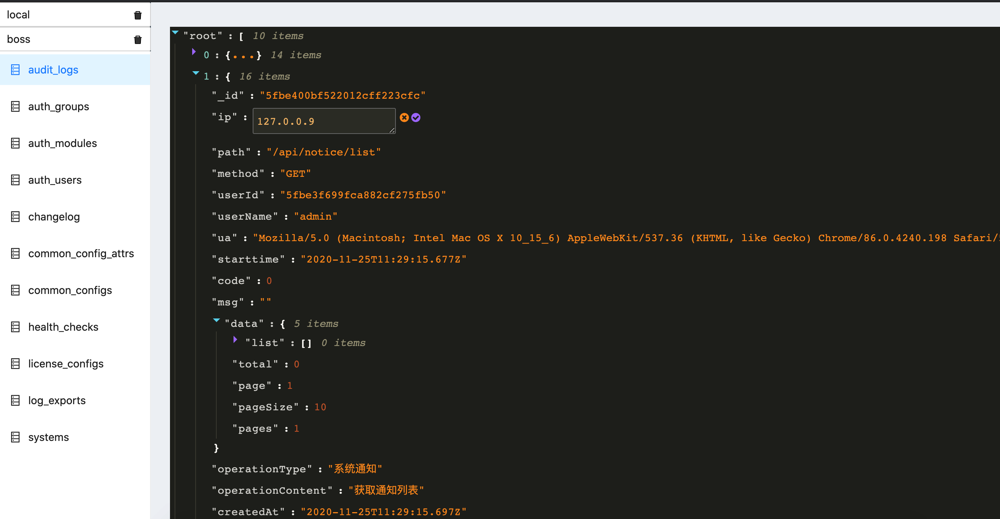

### 一怒之下写的 MongoDB 客户端 web 版

#### Getting Start

1. 启动本地数据库，自己有`mongo`的可以省略
    > docker-compose up -d

2. 修改 `/api/config/local.json` 里的数据库连接参数
3. 分别启动 `api`和`web`
    > 两个都是  npm run dev

#### 一图流

#### TODOS

- 搜索条件栏
- 编辑 、 删除 、 新增功能
- 完善 conn - db - table 之间的联动
- 更多的展示方式，不限于json （优先级低）